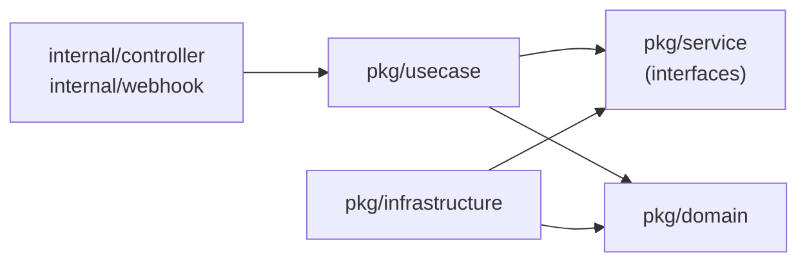

# Contributing to disk-management-agent

Thank you for considering a contribution. Whether you are fixing a bug, adding
support for a new RAID controller, improving tests, or updating documentation,
your help is appreciated.

This guide covers everything you need to get started, understand the
architecture, and submit a high-quality pull request.

## Code of Conduct

All participants are expected to treat each other with respect and
professionalism. Harassment, discrimination, and disruptive behavior will not be
tolerated. Be constructive in code reviews and discussions.

## Getting Started

### Prerequisites

| Tool | Version | Purpose |
|---|---|---|
| Go | 1.25+ | Build and test |
| Make | any | Build system |
| Docker | any | Container image builds |
| Kind | any | End-to-end tests |
| kubectl | any | Cluster interaction |

All other tools (`controller-gen`, `kustomize`, `setup-envtest`, `golangci-lint`)
are downloaded automatically by the Makefile into `./bin/`.

### Setup

```bash
git clone https://github.com/scality/disk-management-agent.git
cd disk-management-agent

go mod download

make manifests generate fmt vet

make test
```

If the tests pass you are ready to contribute.

## Development Workflow

1. Fork the repository and clone your fork.
2. Create a feature branch from `main`:

```bash
git checkout -b feature/my-change
```

3. Make your changes following the coding standards below.
4. Run the full validation suite before pushing:

```bash
make manifests generate fmt vet lint test
```

5. Push your branch and open a pull request against `main`.

### Useful Make Targets

| Target | Description |
|---|---|
| `make build` | Build the manager binary |
| `make run` | Run locally against your current kubeconfig (`NODE_NAME` required) |
| `make manifests` | Regenerate CRD, RBAC, and webhook manifests |
| `make generate` | Regenerate DeepCopy methods |
| `make fmt vet` | Format and vet Go code |
| `make lint` | Run golangci-lint |
| `make lint-fix` | Run golangci-lint and auto-fix what it can |
| `make test` | Unit and controller tests (envtest) |
| `make test-e2e` | End-to-end tests on a Kind cluster |
| `make docker-build` | Build the container image |
| `make install` | Apply CRDs to the cluster in your kubeconfig |
| `make deploy` | Deploy the full stack (CRDs + RBAC + DaemonSet + webhook) |
| `make build-installer` | Generate a single `dist/install.yaml` manifest |

Run `make help` for the complete list.

## Architecture

### Project Structure

```
disk-management-agent/
├── api/v1alpha1/           # CRD type definitions (DiscoveredPhysicalDisk)
├── cmd/
│   ├── config/             # Environment configuration loading
│   └── main.go             # Application entry point
├── config/                 # Kustomize manifests (CRDs, RBAC, manager, webhook)
├── internal/
│   ├── controller/         # Kubernetes reconciler and discovery ticker
│   └── webhook/v1alpha1/   # Validating admission webhook
├── pkg/
│   ├── domain/             # Core business entities
│   ├── service/            # Interface definitions (ports)
│   ├── usecase/            # Application business logic
│   └── infrastructure/     # Adapters: RAID discoverers, K8s store, cache, DI
├── test/e2e/               # End-to-end tests (Kind)
├── Dockerfile
├── Makefile
└── go.mod
```

### Clean Architecture Layers

The code under `pkg/` follows clean architecture. The dependency direction is
always **inward** -- outer layers depend on inner layers, never the reverse.



| Layer | Path | Responsibility |
|---|---|---|
| **Domain** | `pkg/domain/` | Core entities (`DiscoveredPhysicalDrive`, `DiscoveredLogicalVolume`). No external dependencies. |
| **Service** | `pkg/service/` | Interface definitions (ports) that use cases depend on and infrastructure implements. |
| **Use Case** | `pkg/usecase/` | Business logic orchestration. **Must never import infrastructure packages.** |
| **Infrastructure** | `pkg/infrastructure/` | Concrete adapters: RAID discoverers, Kubernetes store, in-memory cache, DI container. |
| **Presentation** | `internal/controller/`, `internal/webhook/` | Kubernetes reconciler, discovery ticker, and validating webhook. |

The `cmd/main.go` entry point wires everything together through the DI container
(`pkg/infrastructure/di/`).

### Key Interfaces (Ports)

| Interface | File | Purpose |
|---|---|---|
| `PhysicalDriveDiscoverer` | `pkg/service/physical_drive_discoverer.go` | Discover physical drives from a specific RAID controller type |
| `LogicalVolumeDiscoverer` | `pkg/service/logical_volume_discoverer.go` | Discover logical volumes (used to enrich drive paths) |
| `DiscoveredPhysicalDiskStore` | `pkg/service/discovered_physical_disk_store.go` | Get/Create `DiscoveredPhysicalDisk` CRs in Kubernetes |
| `DiscoveredDriveCacheWriter` | `pkg/service/discovered_drive_cache_writer.go` | Write discovered drives to the in-memory cache |
| `DiscoveredDriveCacheReader` | `pkg/service/discovered_drive_cache_reader.go` | Read a drive from the cache by CR name |

## Adding a New RAID Controller

Adding support for a new RAID controller type is the most common kind of
contribution. Here is the process step by step.

Suppose you want to add support for a fictional **Adaptec** controller that uses
a CLI tool called `arcconf`.

### 1. Implement the discoverers

Create `pkg/infrastructure/physicaldrivediscoverer/adaptec.go`:

```go
package physicaldrivediscoverer

import (
    "github.com/pkg/errors"
    "github.com/scality/raidmgmt/pkg/domain/ports"

    "disk-management-agent/pkg/domain"
    "disk-management-agent/pkg/service"
)

const adaptecControllerType = "Adaptec"

type Adaptec struct {
    rc ports.RAIDController
}

var _ service.PhysicalDriveDiscoverer = &Adaptec{}

func NewAdaptec(rc ports.RAIDController) *Adaptec {
    return &Adaptec{rc: rc}
}

func (d *Adaptec) DiscoverPhysicalDrives() ([]*domain.DiscoveredPhysicalDrive, error) {
    controllers, err := d.rc.Controllers()
    if err != nil {
        return nil, errors.Wrap(err, "failed to list Adaptec controllers")
    }

    var drives []*domain.DiscoveredPhysicalDrive

    for _, ctrl := range controllers {
        pds, err := d.rc.PhysicalDrives(ctrl.Metadata)
        if err != nil {
            return nil, errors.Wrapf(err, "Adaptec controller %d physical drives", ctrl.ID)
        }

        for _, pd := range pds {
            drives = append(drives, &domain.DiscoveredPhysicalDrive{
                ControllerType: adaptecControllerType,
                ControllerID:   ctrl.ID,
                PhysicalDrive:  pd,
            })
        }
    }

    return drives, nil
}
```

Create the matching `pkg/infrastructure/logicalvolumediscoverer/adaptec.go`
following the same pattern.

### 2. Wire it in the DI container

Add a new field and getter in `pkg/infrastructure/di/` following the existing
MegaRAID/SmartArray pattern:

- Add command runner, RAID controller adapter, and discoverer fields to
  `container.go`.
- Create getter methods in `physical_drive_discoverer.go`,
  `logical_volume_discoverer.go`, `raid_controller.go`, and
  `command_runner.go`.
- Register the new discoverers in the slices inside
  `GetDiscoverPhysicalDrivesUseCase()` in `usecase.go`.

### 3. Add configuration

Add an environment variable (e.g. `ARCCONF_PATH`) in `cmd/config/environment.go`
and pass it through the DI container constructor.

### 4. Update deployment manifests

If the new CLI tool requires a host mount, add the volume and volume mount to
`config/manager/manager.yaml`.

### 5. Write tests

- Add a unit test in `pkg/infrastructure/physicaldrivediscoverer/` for the new
  adapter.
- Extend the use case tests if necessary.

### 6. Update documentation

- Add the new controller to the **Features** and **Prerequisites** sections of
  `README.md`.
- Add the new environment variable to the **Configuration** table in
  `README.md`.

## Coding Standards

### Interface Naming

Interfaces follow the `<Entity><Action>er` pattern:

```go
type PhysicalDriveDiscoverer interface { ... }
type DiscoveredDriveCacheReader interface { ... }
```

Composite interfaces (repositories, services) may use broader names but must
embed small, focused interfaces.

### Interface Size

Interfaces are limited to 1-2 methods. Only composite interfaces may have more
through embedding.

### Error Handling

Wrap all errors with context using `errors.Wrap` or `fmt.Errorf` with `%w`:

```go
return errors.Wrap(err, fmt.Sprintf("disk %s not accessible", diskID))
```

Include relevant identifiers. Avoid duplicating context already present in the
error chain.

### Acronym Casing

Acronyms are either fully uppercase or fully lowercase, never mixed:

```go
// Correct
type MegaRAID struct { ... }
var httpClient *http.Client

// Incorrect
type MegaRaid struct { ... }
var HttpClient *http.Client
```

### Linting

The project uses [golangci-lint](https://golangci-lint.run/) with the
configuration in `.golangci.yml`. Run it locally before pushing:

```bash
make lint
```

## Testing

### Unit Tests

Unit tests and controller tests (using envtest) run together:

```bash
make test
```

Coverage output is written to `cover.out`.

### End-to-End Tests

E2E tests require a Kind cluster. The Makefile manages the cluster lifecycle:

```bash
make test-e2e
```

This creates a Kind cluster named `disk-management-agent-test-e2e`, runs the
tests, and tears it down automatically.

### Writing Tests

| Area | Framework | Location |
|---|---|---|
| Controller reconciliation | [envtest](https://pkg.go.dev/sigs.k8s.io/controller-runtime/pkg/envtest) + Ginkgo/Gomega | `internal/controller/*_test.go` |
| Webhook validation | Standard `testing` + admission context injection | `internal/webhook/v1alpha1/*_test.go` |
| Use cases | [testify](https://github.com/stretchr/testify) with mock service implementations | `pkg/usecase/*_test.go` |
| Infrastructure adapters | testify or Ginkgo | `pkg/infrastructure/**/*_test.go` |
| End-to-end | Ginkgo + kubectl/Kind | `test/e2e/` |

Test files live alongside the code they test with a `_test.go` suffix.

When writing controller tests, use the shared `k8sClient` from the envtest
suite and create your CRs in isolated namespaces or with unique names to avoid
interference between tests.

## Pull Request Process

1. Ensure all CI checks pass (lint + tests).
2. Keep PRs focused: one logical change per PR.
3. Write a clear PR description explaining **what** changed and **why**.
4. At least one approval from a code owner is required before merging.
5. Squash-merge is preferred for a clean commit history.

### Branch Naming

Use descriptive prefixes:

- `feature/` -- New functionality
- `fix/` -- Bug fixes
- `improvement/` -- Refactoring or enhancements
- `docs/` -- Documentation changes

## Issue Reporting

### Bug Reports

When reporting a bug, include:

- Steps to reproduce
- Expected behavior
- Actual behavior
- Environment details (Go version, Kubernetes version, RAID controller type)
- Relevant logs or error messages

### Feature Requests

Describe the use case, the expected behavior, and why the existing functionality
does not cover it.

## Documentation

When making code changes, update relevant documentation:

- If you add or modify CRD fields, regenerate manifests with `make manifests`
  and update the CRD reference table in `README.md`.
- If you add environment variables, update the configuration table in
  `README.md`.
- If you change the architecture or add components, update the architecture
  diagram in `README.md` and the project structure tree in this file.

## License

By contributing to this project, you agree that your contributions will be
licensed under the [Apache License 2.0](LICENSE).
