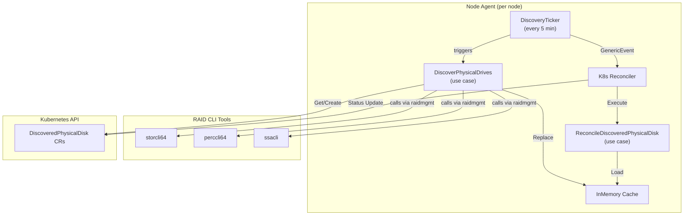

# disk-management-agent

[](https://github.com/scality/disk-management-agent/actions/workflows/test.yml)
[](https://github.com/scality/disk-management-agent/actions/workflows/lint.yml)
[](go.mod)
[](LICENSE)

A Kubernetes node agent that discovers physical HDD drives behind hardware RAID
controllers and represents them as cluster-scoped `DiscoveredPhysicalDisk`
custom resources.

Built with [Operator SDK](https://sdk.operatorframework.io/) and
[raidmgmt](https://github.com/scality/raidmgmt), the agent supports
**MegaRAID** (via `storcli64` / `perccli64`) and **HPE Smart Array** (via
`ssacli`) controllers.

## Why

Storage orchestration platforms such as
[MetalK8s](https://github.com/scality/metalk8s) need a reliable, Kubernetes-native
inventory of the physical disks available on each node. This agent runs as a
DaemonSet, periodically queries the hardware RAID CLIs installed on the host,
and publishes the results as `DiscoveredPhysicalDisk` CRs that higher-level
controllers can consume.

## Architecture



1. A **DiscoveryTicker** fires every 5 minutes and runs the
   **DiscoverPhysicalDrives** use case.
2. The use case invokes every registered `PhysicalDriveDiscoverer` and
   `LogicalVolumeDiscoverer` (MegaRAID + Smart Array adapters), filters to HDD
   only, enriches device paths from logical volume metadata, replaces the
   in-memory cache, and creates any missing `DiscoveredPhysicalDisk` CRs.
3. For CRs that already exist the ticker sends a `GenericEvent` to the
   **Reconciler**, which reads the latest snapshot from the cache and updates
   the CR `.status` (vendor, model, serial, size, paths, etc.).
4. A **validating webhook** restricts CR creation/update to the agent's own
   service account.

## CRD Reference

**Group:** `metalk8s.scality.com`
**Version:** `v1alpha1`
**Kind:** `DiscoveredPhysicalDisk`
**Scope:** Cluster

### Spec (immutable, set at creation)

| Field | Type | Description |
|---|---|---|
| `spec.nodeName` | `string` | Node where the disk was discovered |
| `spec.controller.type` | `string` | RAID controller type (`MegaRAID`, `SmartArray`) |
| `spec.controller.id` | `int` | Controller index |
| `spec.id` | `string` | Disk identifier as reported by the controller |
| `spec.slot.port` | `string` | Port number |
| `spec.slot.enclosure` | `string` | Enclosure number |
| `spec.slot.bay` | `string` | Bay number |

### Status (updated by the reconciler)

| Field | Type | Description |
|---|---|---|
| `status.available` | `*bool` | Whether the drive is present in the slot |
| `status.vendor` | `*string` | Disk manufacturer |
| `status.model` | `*string` | Disk model name |
| `status.serial` | `*string` | Disk serial number |
| `status.wwn` | `*string` | World Wide Name |
| `status.size` | `*uint64` | Capacity in bytes |
| `status.type` | `*string` | Media type: `HDD`, `SSD`, or `NVMe` |
| `status.jbod` | `*bool` | Whether the disk is in JBOD (passthrough) mode |
| `status.status` | `*string` | Current disk status |
| `status.reason` | `*string` | Additional context for the status |
| `status.devicePath` | `*string` | OS device path (e.g. `/dev/sda`) |
| `status.permanentPath` | `*string` | Stable device path (e.g. `/dev/disk/by-id/wwn-0x...`) |

### Example

```yaml
apiVersion: metalk8s.scality.com/v1alpha1
kind: DiscoveredPhysicalDisk
metadata:
  name: node1-megaraid-0-0-32-0
spec:
  nodeName: node1
  controller:
    type: MegaRAID
    id: 0
  id: "0:32:0"
  slot:
    port: "0"
    enclosure: "32"
    bay: "0"
status:
  available: true
  vendor: SEAGATE
  model: ST1000NX0453
  serial: WFK1234
  wwn: "0x5000c500abcdef01"
  size: 1000204886016
  type: HDD
  jbod: true
  status: Online
  devicePath: /dev/sda
  permanentPath: /dev/disk/by-id/wwn-0x5000c500abcdef01
```

## Configuration

The agent is configured through environment variables:

| Variable | Required | Default | Description |
|---|---|---|---|
| `NODE_NAME` | Yes | -- | Kubernetes node name (typically injected via the downward API) |
| `POD_NAMESPACE` | No | -- | Pod namespace, used to build the webhook allowed service account |
| `POD_SERVICE_ACCOUNT` | No | -- | Pod service account name, used for webhook authorization |
| `STORCLI_PATH` | No | `/host/libexec/MegaRAID/storcli/storcli64` | Path to the storcli binary |
| `PERCCLI_PATH` | No | `/host/libexec/MegaRAID/perccli/perccli64` | Path to the perccli binary |
| `SSACLI_PATH` | No | `/host/libexec/ssacli` | Path to the ssacli binary |

The application version is injected at build time via ldflags (defaults to
`dev`).

## Getting Started

### Prerequisites

- Go 1.25+
- A Kubernetes cluster (v1.33+)
- `make`
- Docker or compatible container runtime
- At least one supported RAID CLI tool installed on the target nodes

### Build

```bash
make build
```

### Install CRDs

```bash
make install
```

### Run locally (out-of-cluster, uses current kubeconfig)

```bash
NODE_NAME=my-node make run
```

### Build and push the container image

```bash
make docker-build docker-push IMG=<registry>/disk-management-agent:<tag>
```

### Deploy to a cluster

```bash
make deploy IMG=<registry>/disk-management-agent:<tag>
```

### Uninstall

```bash
make undeploy
```

## Project Structure

```
disk-management-agent/
├── api/v1alpha1/           # CRD type definitions (DiscoveredPhysicalDisk)
├── cmd/
│   ├── config/             # Environment configuration loading
│   └── main.go             # Application entry point
├── config/                 # Kustomize manifests (CRDs, RBAC, manager, webhook)
├── internal/
│   ├── controller/         # Kubernetes reconciler and discovery ticker
│   └── webhook/v1alpha1/   # Validating admission webhook
├── pkg/
│   ├── domain/             # Core business entities (DiscoveredPhysicalDrive, DiscoveredLogicalVolume)
│   ├── service/            # Interface definitions (ports)
│   ├── usecase/            # Application business logic
│   └── infrastructure/     # Adapters: RAID discoverers, Kubernetes store, cache, DI container
├── test/e2e/               # End-to-end tests (Kind)
├── Dockerfile
├── Makefile
└── go.mod
```

The project follows **clean architecture** principles under `pkg/`: use cases
depend only on domain entities and service interfaces (ports), while
infrastructure adapters implement those interfaces. The Operator SDK scaffold
(`cmd/`, `api/`, `internal/`, `config/`) provides the Kubernetes integration
layer.

## Development

```bash
# Generate CRD manifests and RBAC
make manifests

# Generate DeepCopy methods
make generate

# Format and vet
make fmt vet

# Run unit tests (with envtest for controller tests)
make test

# Run linter (golangci-lint)
make lint

# Run end-to-end tests (requires Kind)
make test-e2e
```

## Contributing

Contributions are welcome. See [CONTRIBUTING.md](CONTRIBUTING.md) for
development workflow, coding standards, and pull request guidelines.

## License

This project is licensed under the Apache License 2.0. See [LICENSE](LICENSE)
for details.
