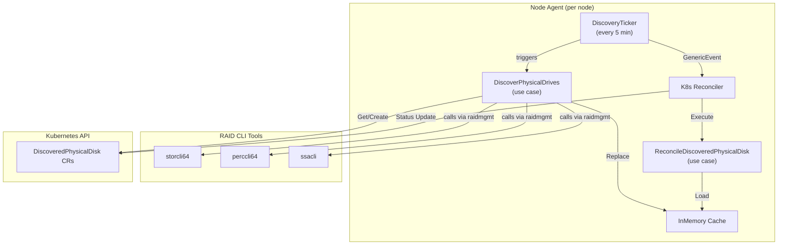

# disk-management-agent

[](https://github.com/scality/disk-management-agent/actions/workflows/test.yml)
[](https://github.com/scality/disk-management-agent/actions/workflows/lint.yml)
[](go.mod)
[](LICENSE)

A Kubernetes node agent that discovers physical HDD drives behind hardware RAID
controllers and exposes them as cluster-scoped `DiscoveredPhysicalDisk` custom
resources. Storage orchestration platforms (such as
[MetalK8s](https://github.com/scality/metalk8s)) and operators can consume
these CRs to build a reliable, Kubernetes-native inventory of every physical
disk in the cluster.

Built with [Operator SDK](https://sdk.operatorframework.io/) and
[raidmgmt](https://github.com/scality/raidmgmt).

## Features

- **MegaRAID support** -- discovers drives via `storcli64` and `perccli64`
  (Broadcom / Dell PERC controllers)
- **HPE Smart Array support** -- discovers drives via `ssacli`
- **Periodic discovery** -- scans every 5 minutes; new drives get CRs
  automatically, existing CRs have their status refreshed
- **Validating webhook** -- restricts CR creation and updates to the agent's own
  service account
- **Cluster-scoped CRD** -- immutable spec (node, controller, slot) with a
  status sub-resource reflecting live hardware state
- **Clean architecture** -- business logic is decoupled from Kubernetes and RAID
  infrastructure through ports and adapters

## Prerequisites

| Requirement | Details |
|---|---|
| Kubernetes | v1.33+ |
| cert-manager | Required for webhook TLS (installed by the default Kustomize overlay) |
| RAID CLI tools | At least one of `storcli64`, `perccli64`, or `ssacli` installed on target nodes |
| Container runtime | Docker or compatible (for building images) |

## Quick Start

### Install CRDs

```bash
make install
```

### Build and push the container image

```bash
make docker-build docker-push IMG=<registry>/disk-management-agent:<tag>
```

### Deploy the agent

```bash
make deploy IMG=<registry>/disk-management-agent:<tag>
```

This deploys a DaemonSet into the `disk-management-agent-system` namespace.
After a few minutes you should see `DiscoveredPhysicalDisk` resources appear:

```bash
kubectl get discoveredphysicaldisks
```

### Generate a single install manifest

If you prefer applying a single YAML file instead of using `make deploy`:

```bash
make build-installer IMG=<registry>/disk-management-agent:<tag>
kubectl apply -f dist/install.yaml
```

### Uninstall

```bash
make undeploy
```

## How It Works



The agent runs as a DaemonSet -- one pod per node. Each instance only manages
disks for its own node.

1. A **DiscoveryTicker** fires every 5 minutes and runs the
   **DiscoverPhysicalDrives** use case.
2. The use case invokes every registered `PhysicalDriveDiscoverer` and
   `LogicalVolumeDiscoverer` adapter (MegaRAID + Smart Array), keeps only HDD
   drives, enriches device paths from logical volume metadata, replaces the
   in-memory cache, and creates any missing `DiscoveredPhysicalDisk` CRs.
3. For CRs that already exist the ticker sends a `GenericEvent` to the
   **Reconciler**, which reads the latest snapshot from the cache and updates
   the CR `.status` (vendor, model, serial, size, paths, etc.).
4. A **validating webhook** restricts CR creation and updates to the agent's own
   service account.

If a RAID CLI tool is not installed on a node (e.g. `storcli64` on a
SmartArray-only host), the corresponding discoverer logs the error and is
skipped -- it does not block other discoverers.

## CRD Reference

**Group:** `metalk8s.scality.com`
**Version:** `v1alpha1`
**Kind:** `DiscoveredPhysicalDisk`
**Scope:** Cluster

### Spec (immutable, set at creation)

| Field | Type | Description |
|---|---|---|
| `spec.nodeName` | `string` | Node where the disk was discovered |
| `spec.controller.type` | `string` | RAID controller type (`MegaRAID`, `SmartArray`) |
| `spec.controller.id` | `int` | Controller index |
| `spec.id` | `string` | Disk identifier as reported by the controller |
| `spec.slot.port` | `string` | Port number |
| `spec.slot.enclosure` | `string` | Enclosure number |
| `spec.slot.bay` | `string` | Bay number |

### Status (updated by the reconciler)

| Field | Type | Description |
|---|---|---|
| `status.available` | `*bool` | Whether the drive is present in the slot |
| `status.vendor` | `*string` | Disk manufacturer |
| `status.model` | `*string` | Disk model name |
| `status.serial` | `*string` | Disk serial number |
| `status.wwn` | `*string` | World Wide Name |
| `status.size` | `*uint64` | Capacity in bytes |
| `status.type` | `*string` | Media type: `HDD`, `SSD`, or `NVMe` |
| `status.jbod` | `*bool` | Whether the disk is in JBOD (passthrough) mode |
| `status.status` | `*string` | Current disk status |
| `status.reason` | `*string` | Additional context for the status |
| `status.devicePath` | `*string` | OS device path (e.g. `/dev/sda`) |
| `status.permanentPath` | `*string` | Stable device path (e.g. `/dev/disk/by-id/wwn-0x...`) |

### Example

```yaml
apiVersion: metalk8s.scality.com/v1alpha1
kind: DiscoveredPhysicalDisk
metadata:
  name: node1-megaraid-0-0-32-0
spec:
  nodeName: node1
  controller:
    type: MegaRAID
    id: 0
  id: "0:32:0"
  slot:
    port: "0"
    enclosure: "32"
    bay: "0"
status:
  available: true
  vendor: SEAGATE
  model: ST1000NX0453
  serial: WFK1234
  wwn: "0x5000c500abcdef01"
  size: 1000204886016
  type: HDD
  jbod: true
  status: Online
  devicePath: /dev/sda
  permanentPath: /dev/disk/by-id/wwn-0x5000c500abcdef01
```

## Configuration

The agent is configured through environment variables. When deployed via the
default Kustomize manifests, `NODE_NAME`, `POD_NAMESPACE`, and
`POD_SERVICE_ACCOUNT` are injected automatically.

| Variable | Required | Default | Description |
|---|---|---|---|
| `NODE_NAME` | Yes | -- | Kubernetes node name (injected via the downward API) |
| `POD_NAMESPACE` | No | -- | Pod namespace; used to build the webhook allowed service account |
| `POD_SERVICE_ACCOUNT` | No | -- | Pod service account name; used for webhook authorization |
| `STORCLI_PATH` | No | `/host/libexec/MegaRAID/storcli/storcli64` | Path to the `storcli64` binary |
| `PERCCLI_PATH` | No | `/host/libexec/MegaRAID/perccli/perccli64` | Path to the `perccli64` binary |
| `SSACLI_PATH` | No | `/host/libexec/ssacli` | Path to the `ssacli` binary |

The application version is injected at build time via `-ldflags` and defaults to
`dev`.

## Development

```bash
make build                # Build the manager binary
NODE_NAME=my-node make run  # Run locally against your current kubeconfig
make manifests            # Regenerate CRD, RBAC, and webhook manifests
make generate             # Regenerate DeepCopy methods
make fmt vet              # Format and vet
make lint                 # Run golangci-lint
make test                 # Unit + controller tests (envtest)
make test-e2e             # End-to-end tests (Kind)
```

See [CONTRIBUTING.md](CONTRIBUTING.md) for the full development guide, coding
standards, architecture overview, and pull request process.

## Contributing

Contributions are welcome -- whether it is a bug fix, a new RAID controller
adapter, documentation improvements, or anything else. See
[CONTRIBUTING.md](CONTRIBUTING.md) to get started.

## License

This project is licensed under the Apache License 2.0. See [LICENSE](LICENSE)
for details.
